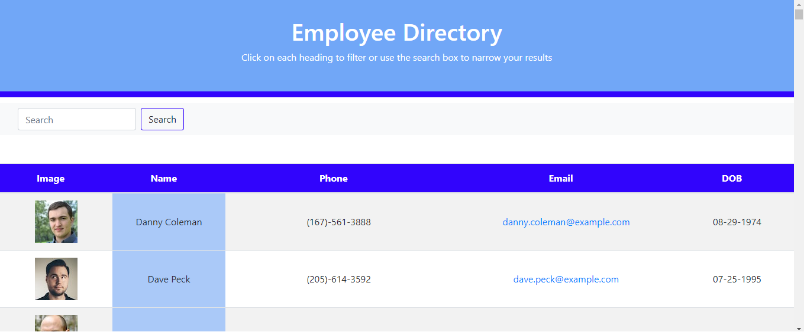

# Professional README Generator

## Task

create a employee directory with React. This assignment will require you to break up your application's UI into components, manage component state, and respond to user events.

The application will be invoked by using the following command:

```bash
npm start
```

## User Story

```
As a user, I want to be able to view my entire employee directory at once so that I have quick access to their information.
```
### Built With
----
```
  * HTML
  * Node.js
  * React
    - react-dom
    - react-router-dom
    - react-scripts
  * Javascript
  * Bootstrap
  * CSS
  * Axios
```    

### How to Use
----
```
  1- Type "npm start" in the console.
  2- Its going to take you to the website https://localhost:3000.
  3- Its going to show you 500 random employees, you can search by Name, Phone, Email and DOB.
  4- You can sort through Name, Phone, DOB and Email with Ascend or Descend
```    
### Submission
---

Github Repo URL: 
[https://github.com/v1zconde/react_employee_directory](https://github.com/v1zconde/react_employee_directory)

Deployed URL: 
[https://github.com/v1zconde/react_employee_directory](https://github.com/v1zconde/react_employee_directory)


## Example
---
### React Employee Directory


  ## Questions
you have any questions about the repo, open an issue or contact me directly at rvasquez1@gmail.com. You can find more of my work at 
  Github: [v1zconde](http://github.com/v1zconde)

